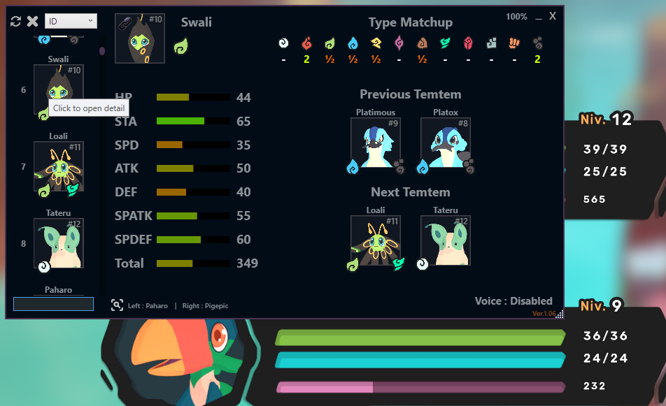
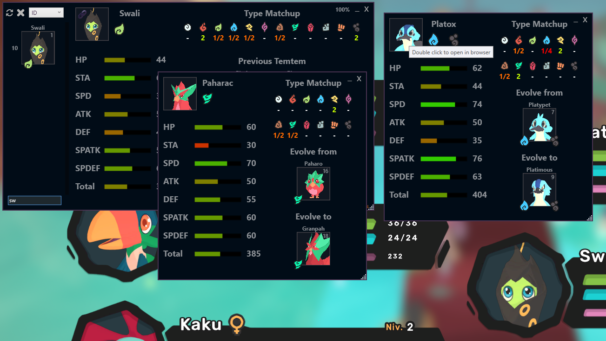
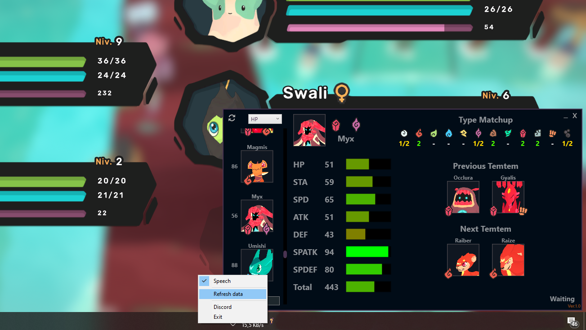

# Temtem Overlay by Antize

## Last Version
**Antize Temtem (Ver.1.00)**

## Preview

## Antize Temtem Overlay
Free Temtem overlay to see all Temtem stats.

Antize Temtem Overlay can be put over your game to get an overview of all temtem while playing, your game must set in Borderless or Windowed, you have a search box and speech search (Can be enabled in options).

## Do you have an issue or Feedback ?
If you have an issue, Feedback or you think there is an error in data, just open an issue or send me a message through Discord, I will proceed to the changes as soon as possible.

[Come on Discord:](https://discord.gg/mQ6Bca7) https://discord.gg/mQ6Bca7

## Known issues
- If **Antize Temtem Overlay** is launched as admin Malwarebytes detects as false positive, general problem with C# software.
- Windows defender (Smart screen) Block for unrecognized app. (Choice Run anyway).
- Avast detect as false positive : IDP Generic.

## How do I get started ?
  -  [Download Temtem-Overlay](https://github.com/Antize/MyTemtem/releases/)  
  -  Extract files and run `MyTemtem.exe`
  -  To put Antize Temtem Overlay on top of your game, your game must be set in Borderless or Windowed.

Inside of package, you must have the following files:
- **MyTemtem.exe:** Software
- **Settings.xml:** Settings to refresh data
- **TemtemList.xml:** Local Temtem data
- **Temp folder:** Local Temtem files

## Prerequisite
May be **Net Framework 4.5**

## Authors
- Antize

## License
Copyright@2019 Antize all rights reserved.

En téléchargeant vous acceptez la récolte de données non sensible.
