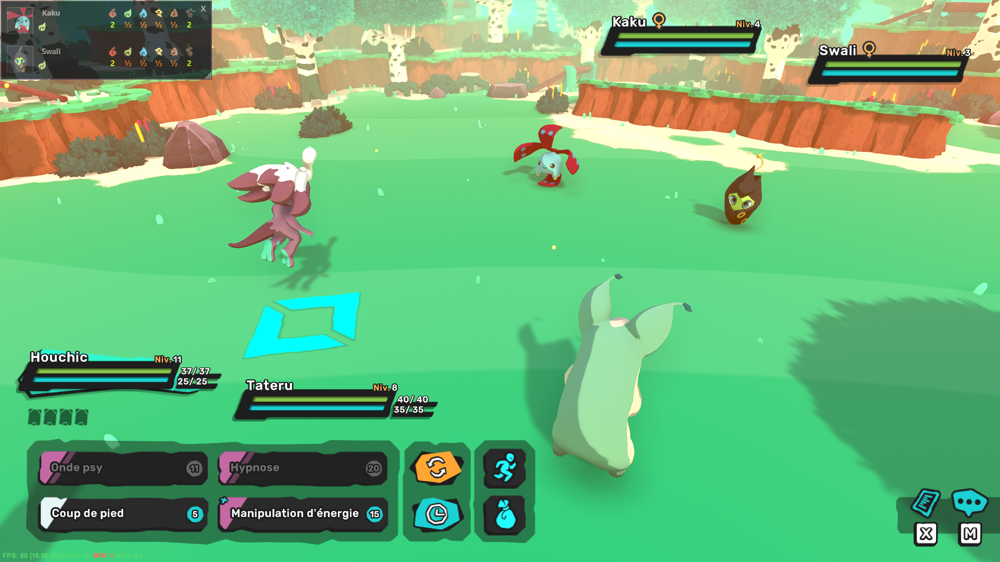
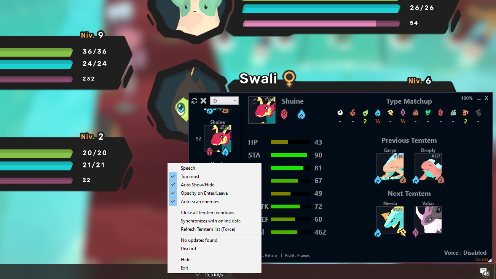

# Temtem Overlay by Antize (Updated)

## Last Version
**Antize Temtem (Ver.1.13)** 

Uses data from the official wiki so you don't have to update the overlay every time the game is updated.

**The overlay :**
- **Doesn't** read Temtem memory
- **Doesn't** intercept any Client-Server communication
- **Doesn't** automate any part of gameplay
- **Doesn't** do anything a player couldn't do themselves using Alt+Tab -> https://temtem.gamepedia.com/Temtem_Wiki

**Keep in memory**, this is not a cheat, it does nothing more than ALT+TAB and go to the wiki, it does not read memory or intercept network data!

## Preview

## Antize Temtem Overlay
A free Temtem overlay to easily see all Temtem's statistics and can also automatically looks at what Temtem are on the enemy team.

Antize Temtem Overlay can be put over your game to get an overview of all temtem while playing, your game must be set in Borderless or Windowed, you have a search box and speech search to find Temtem in the list.

**Speech commandes : (Speech must be enabled in options)**
  - Internet + Temtem name = Open Temtem page on browser  
  - Open/Ouvrir + Temtem name = Open Temtem detail  
  - Close/Fermer + Temtem name = Close Temtem detail  
  - See/Voir + Temtem name = See Temtem on main window  
  - Open Left/Right Temtem & Ouvrir Temtem Gauche/Droite = Open Left/Right ennemy Temtem detail
  - Scan enemy Temtem/Scan Temtem ennemis = Start a scan of the enemy team

## Do you have an issue or Feedback ?
If you have an issue, Feedback or you think there is an error in data, just open an issue or send me a message through Discord, I will proceed to the changes as soon as possible.

[Come on Discord:](https://discord.gg/n2KW2tB) https://discord.gg/n2KW2tB

## Known issues
- If **Antize Temtem Overlay** is launched as admin Malwarebytes detects as false positive, general problem with C# software.
- Windows defender (Smart screen) Block for unrecognized app. (Choice Run anyway).
- Avast detect as false positive : IDP Generic.
- Antivirus ask for Voice accces : Software must have access to the microphone for voice commands (Can be blocked if you wish).

## How do I get started ?
  -  [Download Temtem-Overlay.](https://github.com/Antize/MyTemtem/releases/)
  -  Extract files and run `MyTemtem.exe`.
  -  To put Antize Temtem Overlay on top of your game, your game must be set in Borderless.
  -  Initial start-up can take a little time, as can updating data.

Inside of package, you must have the following files:
- **MyTemtem.exe:** Software
- **Settings.xml:** Settings
- **TemtemList.xml:** Local Temtem data
- **Temp folder:** Local Temtem files
- **Tesseract.dll, x64 folder, x86 folder & tessdata folder:** OCR has dependencies for automatically looks at what Temtem are on the enemy team
- **Resolutions.csv:** Resolution settings for OCR

Tactical Tracker Overlay for the Temtem game

## Prerequisite
May be **Net Framework 4.5**

## Authors
- Antize

## License
Copyright@2019 Antize all rights reserved.
